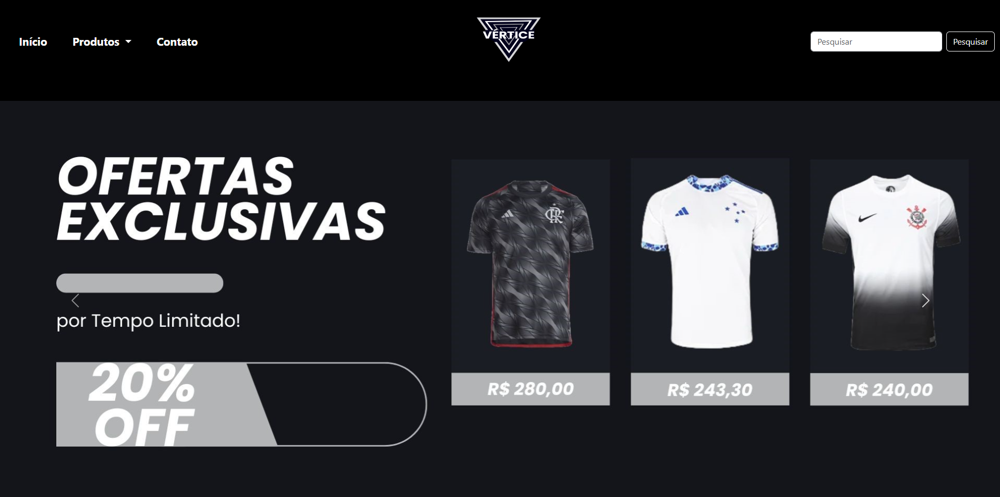
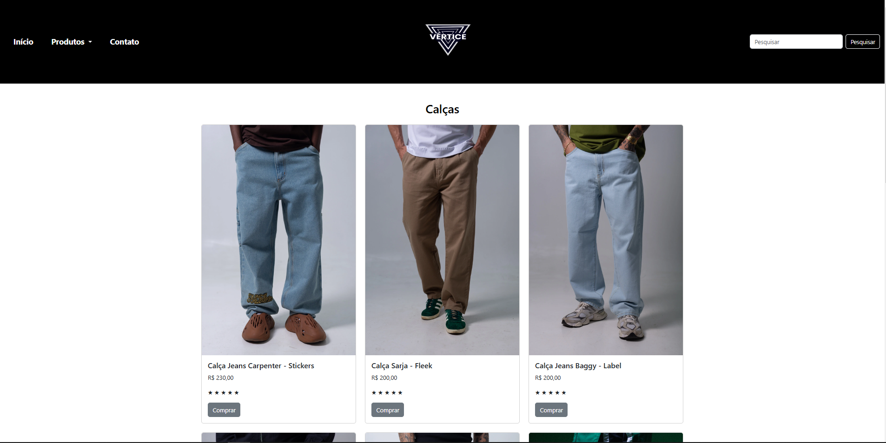
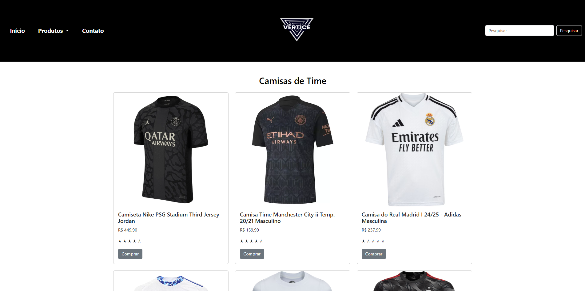
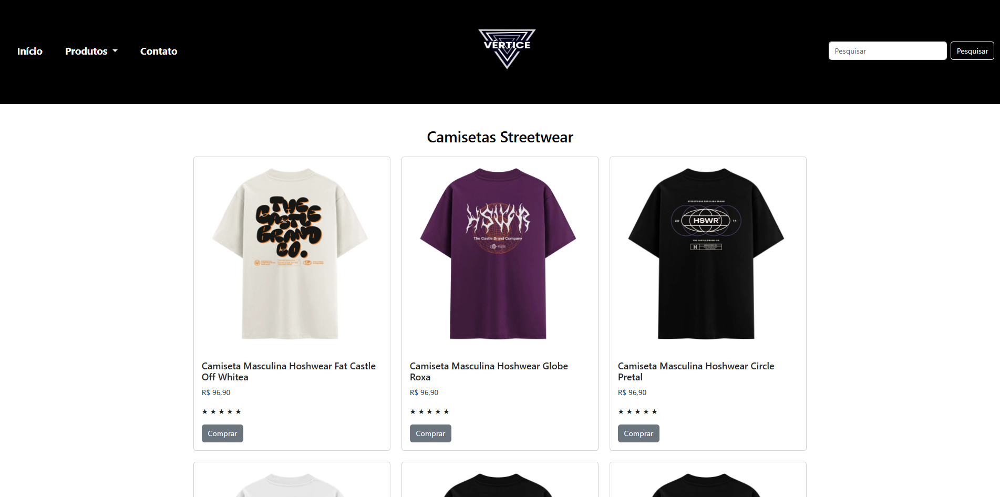
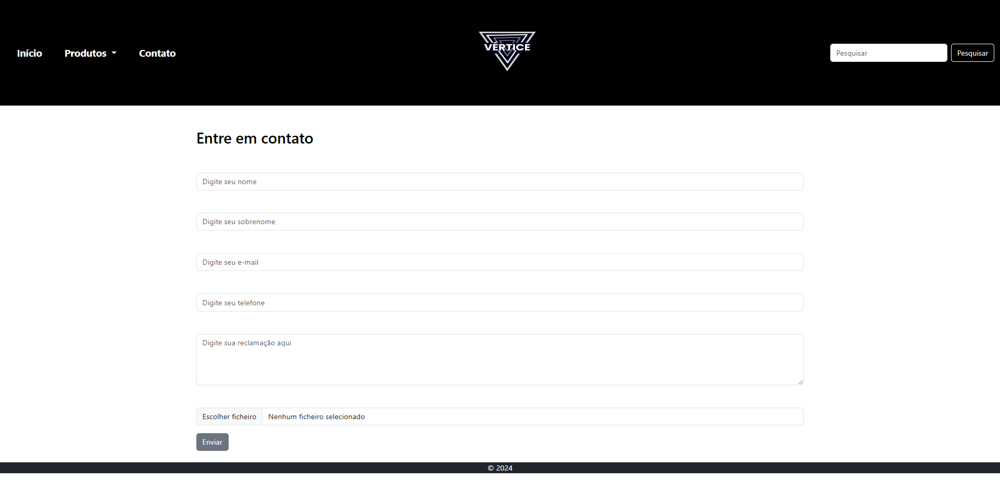

# MeuPrimeiroBriefing

# Projeto Vértice

# Introdução

Este projeto consiste na construção de um site de e-commerce focado em roupas, chamado Vértice. O objetivo do site é fornecer uma plataforma intuitiva e visualmente atraente para os usuários navegarem, visualizarem e comprarem produtos como calças, camisetas e camisas de time. O site é construído utilizando HTML, CSS, e JavaScript, com o auxílio do framework Bootstrap para garantir uma interface responsiva e moderna.

# Estrutura do Projeto

A estrutura do site é organizada de forma que cada seção e página ofereça uma experiência de navegação clara e direta. Abaixo está a descrição das principais partes do projeto:

**Página Principal (index.html):** Página inicial do site com um carrossel de imagens, destacando os principais produtos e promoções.

**Página de Produtos:** Páginas específicas para cada categoria de produto, como Calça.html, Time.html e Street.html. Cada página contém cards de produtos com descrições, avaliações e preços.

**Página de Contato (Contato.html):** Página para os usuários entrarem em contato com a loja.

**CSS (css/Vertice.css):** Arquivo de estilização personalizado do site.

**Imagens:** Armazenadas na pasta img, contendo as imagens de produtos e logotipo.

**JavaScript:** Um script que controla o modal do carrinho de compras e fornece feedback visual aos usuários quando um produto é adicionado ao carrinho.

# Etapas Implementadas

**1. Estrutura HTML:** Construção das páginas principais e de navegação.

**2. Navegação e Cabeçalho:** Implementação de uma barra de navegação responsiva com links para as principais seções do site.

**3. Carrossel na Página Principal:** Uso de um carrossel para exibir imagens promocionais dos produtos.

**4. Cards de Produtos:** Exibição dos produtos com descrição, avaliação e preço, com um botão "Comprar" que aciona um modal de confirmação.

**5. Modal de Adição ao Carrinho:** Implementação de um modal que aparece ao adicionar um produto ao carrinho, fornecendo uma mensagem de sucesso.

**6. Página de Contato:** Formulário de contato para permitir que os usuários enviem dúvidas ou sugestões para a loja.

# Ferramentas Utilizadas

**HTML5:** Estruturação das páginas e elementos.

**CSS3:** Estilização das páginas e personalização do layout.

**Bootstrap 5:** Framework para responsividade e componentes pré-construídos (navbar, carrossel, cards e modal).

**JavaScript:** Scripts para exibir o modal ao adicionar produtos ao carrinho e para facilitar a navegação interativa.

# Conclusão

O projeto Vértice oferece uma base sólida para uma loja online de roupas, com funcionalidades essenciais para navegação e experiência de compra. A estrutura e o design são responsivos, otimizados para dispositivos móveis e desktop, e facilitam a navegação e a usabilidade para o usuário final.
